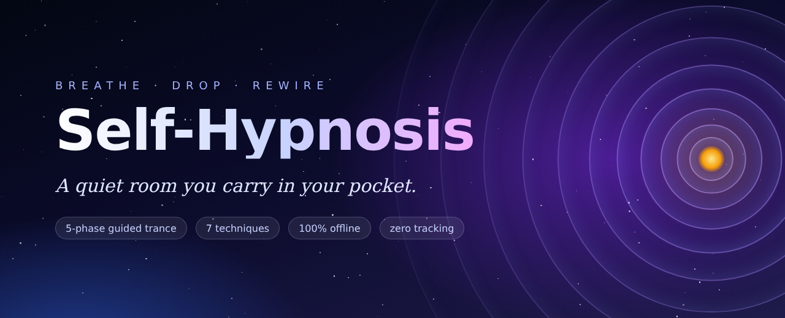
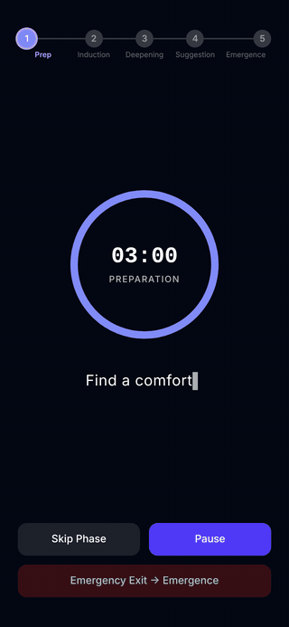
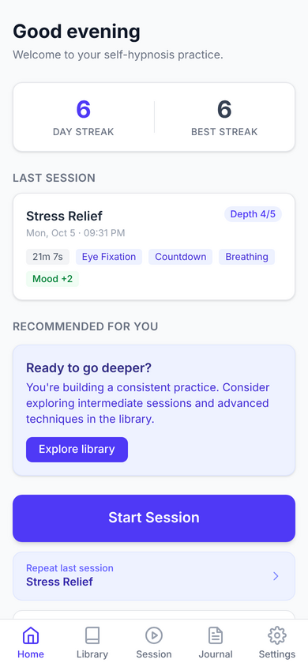
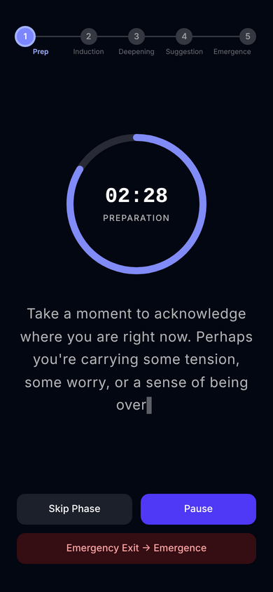
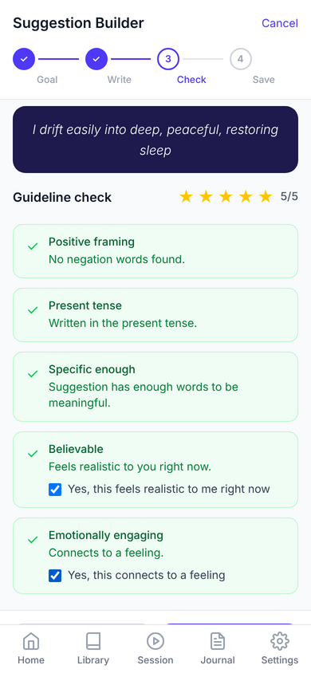
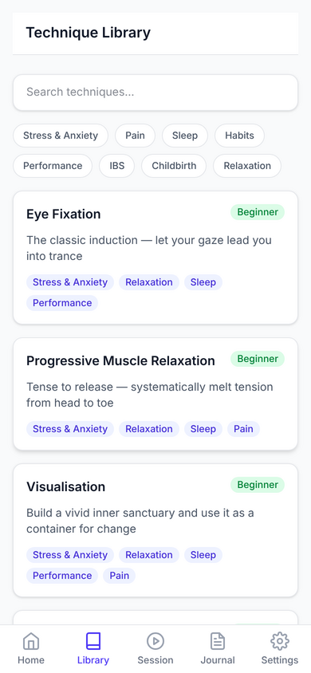
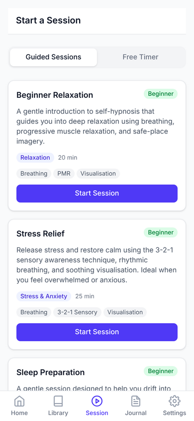
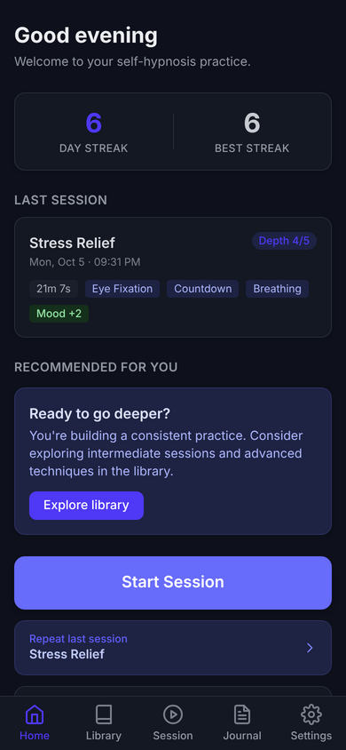

<p align="center">
  
</p>

<p align="center">
  <strong>Close your eyes. Count down. Drop in. Plant a thought. Come back lighter.</strong><br>
  <sub>An offline-first PWA for guided self-hypnosis. No accounts, no cloud, no tracking. Your mind stays on your device.</sub>
</p>

<p align="center">
  
  
  
  
  
</p>

---

## 🌙 What is this?

Ten minutes from now you could be somewhere quieter.

**Self-Hypnosis** is a pocket-sized trance studio. It guides you through the same five-phase arc that clinical hypnotherapists use: _preparation → induction → deepening → suggestion → emergence_. The script appears one soft line at a time, a breathing ring counts down each phase, and the text fades away when it's time to close your eyes.

Then it hands the pen to you. You write your own suggestions, the app checks them against the rules that make suggestions work, and it slips your words into your next session, right where your mind is most open to them.

It runs fully in your browser. Install it to your home screen, switch on airplane mode, and it keeps working.

<p align="center">
  
</p>

## ✨ A look around

<table>
  <tr>
    <td align="center"><br><sub><b>Home</b>: streaks, last session, nudges</sub></td>
    <td align="center"><br><sub><b>The session</b>: a dark room for your eyes</sub></td>
    <td align="center"><br><sub><b>Suggestion builder</b>: write your own spell</sub></td>
  </tr>
  <tr>
    <td align="center"><br><sub><b>Library</b>: 7 evidence-based techniques</sub></td>
    <td align="center"><br><sub><b>Guided sessions</b>: relax, de-stress, sleep, pain, confidence</sub></td>
    <td align="center"><br><sub><b>Dark mode</b>: for 2am sessions</sub></td>
  </tr>
</table>

## 🌀 The five-phase descent

Every guided session follows the same shape. The engine enforces it, so you never get yanked out of trance halfway through.

| Phase              | What happens                                                                    | Length   |
| ------------------ | ------------------------------------------------------------------------------- | -------- |
| 🪑 **Preparation** | Settle in. Set an intention. Notice the breath you're already breathing.        | 2–5 min  |
| 👁️ **Induction**   | Narrow your attention with eye fixation, breathing or a body scan.              | 3–7 min  |
| 🕳️ **Deepening**   | Count down a staircase and let each number take you further in.                 | 3–5 min  |
| 🌱 **Suggestion**  | Present-tense, positive phrases, including **your own**, land where it's quiet. | 5–15 min |
| 🌅 **Emergence**   | Count back up, one to five. Fingers, toes, eyes open, refreshed.                | 2–3 min  |

Need out _now_? The **Emergency Exit** jumps straight to emergence. You still come up gently, because emergence can never be skipped.

## 🧰 What's inside

- **🎧 Guided sessions**: five scripted journeys (Beginner Relaxation, Stress Relief, Sleep Preparation, Pain Management, Confidence Building), with a typewriter script reveal, a phase ring, pause/skip, and a post-session check-in for depth and mood.
- **⏳ Free timer**: no script, just you, a countdown, and shuffled technique cards for inspiration.
- **📚 Technique library**: eye fixation, progressive muscle relaxation, visualisation, countdown deepening, controlled breathing, Betty Erickson's 3-2-1 sensory method, and autogenic training. Each has steps, the science, and citations.
- **✍️ Suggestion builder**: pick a goal, write (or dictate) your suggestion, and get a live check for positive framing, present tense, specificity, believability and emotional pull. Your best suggestions for a goal are woven into that goal's sessions automatically.
- **📓 Journal**: capture what came up with mood/depth tracking and tags, linked to the session it came from.
- **🔥 Streaks & stats**: day streaks, total time, average depth, most-used techniques, and gentle recommendations that change as your practice grows.
- **🛡️ Safety first**: a contraindication screen before you start, amber/red risk levels, a medical notice for pain sessions, and a safety acknowledgement. Hypnosis is a complement to care, never a replacement.
- **🔒 Private by design**: every byte lives in IndexedDB on your device. Export it as JSON anytime, or wipe it in two taps.

## 📜 A brief history of putting yourself under

People have been talking themselves into altered states for as long as there have been people. The modern story is stranger than you'd expect.

> **Antiquity: the temple sleep.** In ancient Egypt and Greece, the sick slept in temples, the Greek _Asclepieia_ among them, hoping a healing dream would arrive in the night. Ritual, expectation and suggestion did much of the work, though nobody had names for them yet.

> **1770s: Mesmer's magnetic fluid.** Franz Mesmer filled Paris salons with patients sitting around tubs of iron filings, convinced an invisible "animal magnetism" flowed through them. In 1784 a royal commission that included **Benjamin Franklin** and **Antoine Lavoisier** tested it and concluded the effects came from _imagination_. They meant it as a debunking. Two centuries later it reads like a discovery.

> **1840s: surgery without anaesthetic.** In Calcutta, Scottish surgeon **James Esdaile** reported hundreds of operations performed on patients in a mesmeric trance, in the years just before ether and chloroform arrived.

> **1841–1843: the word is born.** Manchester surgeon **James Braid** watched a mesmerist's show, went home, and worked out that the effect came from _fixed, focused attention_, not magnetism. He named it **hypnotism** after _Hypnos_, the Greek god of sleep. It was a misnomer, since hypnosis isn't sleep, but the name stuck.

> **1920s: "Every day, in every way, I'm getting better and better."** French pharmacist **Émile Coué** taught patients to recite this phrase to themselves and started a worldwide craze for _conscious autosuggestion_. It was self-hypnosis for the masses, and the ancestor of every affirmation you've seen since.

> **1932: autogenic training.** German psychiatrist **Johannes Heinrich Schultz** published a structured method of self-induced calm built on simple formulas: _"My right arm is heavy… my right arm is warm."_ It's still taught today, and it's in the library here.

> **Mid-20th century: the Ericksons.** **Milton Erickson** rewrote clinical hypnosis with an indirect, permissive, story-driven style. His wife **Betty Erickson** developed a self-hypnosis method that walks through three things you see, hear and feel, then two, then one. That's the **3-2-1 technique** in this app.

> **1955 & 1958: legitimacy.** The British Medical Association, then the American Medical Association, recognised hypnosis as a valid therapeutic tool.

> **1984: the gut listens.** Gastroenterologist **Peter Whorwell** published a trial of _gut-directed hypnotherapy_ for irritable bowel syndrome in _The Lancet_. It became one of the best-evidenced uses of hypnosis in medicine.

> **2016: the brain on trance.** A Stanford team led by **David Spiegel** scanned highly hypnotisable people and found three signatures: a quieter dorsal anterior cingulate (less "worry about the context"), tighter links between the prefrontal cortex and insula (more body control), and looser links to the default mode network (less self-conscious narration). Hypnosis turned out to be a measurable brain state, not just a stage act.

**Today:** you, a phone, and ten quiet minutes. The tools that once needed a mesmerist, a surgeon or a psychiatrist fit in a browser tab.

> 💡 Want the deep cut? [`research.md`](research.md) is the source material behind every technique, protocol and safety rule in the app.

## 🚀 Run it

```bash
npm install
npm run dev        # http://localhost:3000
```

Build the static, installable PWA:

```bash
npm run build      # static export → out/
npm run start      # serve out/ locally
```

Deploy `out/` to any static host (GitHub Pages, Netlify, Cloudflare Pages, S3). There's no server to run.

### Scripts

| Command                 | Description                                       |
| ----------------------- | ------------------------------------------------- |
| `npm run dev`           | Start Next.js dev server (Turbopack)              |
| `npm run build`         | Production build (static export to `out/`)        |
| `npm run start`         | Serve production build locally                    |
| `npm test`              | Run tests in watch mode                           |
| `npm run test:run`      | Run tests once                                    |
| `npm run test:coverage` | Generate coverage report                          |
| `npm run lint`          | Check for lint errors                             |
| `npm run lint:fix`      | Fix lint errors                                   |
| `npm run format`        | Format code with Prettier                         |
| `npm run typecheck`     | TypeScript type checking                          |
| `npm run knip`          | Find unused code                                  |
| `npm run check`         | Run all checks (typecheck + lint + format + knip) |

## 🏗️ Under the hood

**Next.js 15 (App Router, static export)** · **React 19** · **TypeScript** · **Tailwind CSS 4** · **Dexie.js / IndexedDB** · **Serwist service worker** · **Zod** · **Vitest**

```
app/                      # Routes: home, library, session, suggestions, journal, settings, onboarding
  session/play/           # Full-screen session player (/session/play/?id=…)
  journal/entry/          # Journal entry view (/journal/entry/?id=…)
  sw.ts                   # Service worker (offline cache)
src/
  lib/session/            # Session engine state machine, phase config, audio manager
  lib/suggestions/        # Suggestion guideline validator
  lib/stats/              # Streak calculation
  lib/db.ts               # Dexie schema: settings, sessions, suggestions, journal
  hooks/                  # useSessionEngine, live Dexie queries, notifications…
  components/             # UI by feature (dashboard, session, library, journal…)
  content/                # Technique and guided-session scripts (JSON)
specs/                    # Feature specs
research.md               # The research everything is built on
```

The session engine is a small class-based state machine ticking once a second. It persists progress to IndexedDB as it goes, so an interrupted session is recorded honestly and a finished one counts toward your streak.

## ⚠️ A gentle but important note

Self-hypnosis is a **complementary practice**. It isn't a substitute for medical or psychological care. If you live with psychosis, a dissociative disorder, epilepsy, PTSD or severe trauma, talk to a qualified professional first. The app screens for these at onboarding and will hold sessions back if needed. Never use it while driving or operating machinery.

You are always in control. You can open your eyes at any moment.

## 📄 License

[MIT](LICENSE). Take it, fork it, make something calm.

<p align="center"><sub>Made slowly, breath by breath. 🌙</sub></p>
